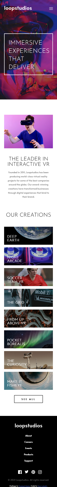

## Welcome! 👋

Thanks for checking out this front-end coding challenge.

**To do this challenge, you need a good understanding of HTML and CSS and a basic understanding of JavaScript.**

## The challenge

- Pour ce challenge j'ai pris note des largeur des appareil :
-   Ordinateur => 1440
-   Mobile => 365

- Les tests ont été réalisés sous android pour mobile et pour ordinateur. Il faudra passé la largeur de l'écran à celle ci-dessus pour que le site soit adapté, bien qu'il reste responsif dans une taille supérieure.
    
- J'ai réalisé ce challenge en 10h25 vous pouvez retrouvé mes notes que j'ai prise tout au long de mes heures de travail ici => https://www.notion.so/Test-N-1-39e54311b78047ec8c1e57fc9e1d5d7d

## SCREENSHOT
- Desktop

- Mobile

**Have fun building!** 🚀
# Challenge-front-end
